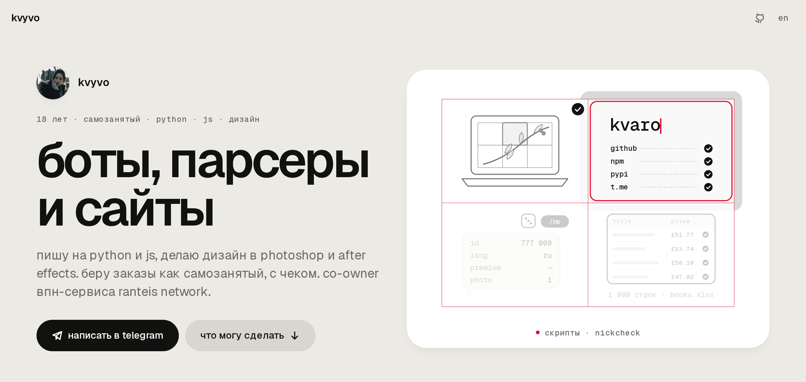

<a href="https://kvyvo.github.io/">
  <picture>
    <source media="(prefers-color-scheme: dark)" srcset="docs/hero-dark.png">
    
  </picture>
</a>

# kvyvo

боты, парсеры и сайты. мне 18, учусь в колледже и беру заказы как самозанятый, с чеком. пишу на python и js, дизайн делаю в photoshop и after effects. co-owner впн-сервиса [ranteis network](https://ranteis.one).

**[kvyvo.github.io →](https://kvyvo.github.io/)** · [telegram](https://t.me/kvyvo) · [instagram](https://www.instagram.com/kvyvo_) · discord: `kvyvo.` · [english below](#english)

## что могу сделать

- **телеграм-боты** — aiogram 3: команды, кнопки, карточки, работа с апи. пример: [whoami-bot](https://github.com/kvyvo/whoami-bot)
- **скрипты и автоматизация** — проверки через апи, пакетная обработка, выгрузки. пример: [nickcheck](https://github.com/kvyvo/nickcheck)
- **парсеры** — данные с сайтов в excel, csv или базу. пример: [books-scraper](https://github.com/kvyvo/books-scraper)
- **сайты и фронтенд** — html, css, react. адаптив, тёмная тема, анимация. пример: [kalka](https://kvyvo.github.io/kalka/)
- **дизайн** — обложки, баннеры и макеты в photoshop, моушн в after effects

как работаем: пишешь в [telegram](https://t.me/kvyvo) → обсуждаем срок и цену → делаю → сдаю работу и чек.

## проекты

| проект | что делает | стек |
|---|---|---|
| **[kalka](https://github.com/kvyvo/kalka)**<br>[открыть →](https://kvyvo.github.io/kalka/) | световой стол из экрана: любая картинка переносится на бумагу в натуральную величину, по частям | js без сборки, pwa, web workers, playwright |
| **[nickcheck](https://github.com/kvyvo/nickcheck)** | короткие произносимые ники с проверкой занятости на 20 сервисах и свободные домены через rdap | python, requests |
| **[whoami-bot](https://github.com/kvyvo/whoami-bot)** | телеграм-бот: что телеграм рассказывает о тебе боту. плюс кубики и печенье с предсказанием | python, aiogram 3.31 |
| **[books-scraper](https://github.com/kvyvo/books-scraper)** | проходит все страницы books.toscrape.com и собирает 1000 книг в таблицу excel | requests, beautifulsoup, pandas |
| **[ranteis network](https://ranteis.one)** · [бот](https://t.me/RanteisNetworkBot) | впн-сервис, co-owner | — |

## сайт

[kvyvo.github.io](https://kvyvo.github.io/) лежит в `site/` и публикуется из [kvyvo/kvyvo.github.io](https://github.com/kvyvo/kvyvo.github.io). дизайн-система kalka: тёплый серый холст, чёрно-белые компоненты, один красный акцент, geist, движение на пружинах. наверху шапка; при прокрутке она уезжает, и сверху появляется навигация 01–04 с подсветкой текущего раздела, по <kbd>⌘k</kbd> — палитра команд. ru/en, светлая и тёмная тема, без сборки.

```
npm run serve     # http://localhost:5173
npm run check     # сценарии в chromium: ошибки, телефон 320 px, палитра, язык, тёмная тема, 404
npm run shots     # картинки для readme и og-превью с настоящей страницы
```

---

## english

**kvyvo** — bots, scrapers and websites. 18, at college, taking orders as a registered self-employed (russia). python and js, design in photoshop and after effects. co-owner of the [ranteis network](https://ranteis.one) vpn.

- **[kalka](https://github.com/kvyvo/kalka)** · [open →](https://kvyvo.github.io/kalka/) — a light table from a laptop screen: any picture onto paper at true size, part by part
- **[nickcheck](https://github.com/kvyvo/nickcheck)** — pronounceable handles checked on 20 services, free domains over rdap
- **[whoami-bot](https://github.com/kvyvo/whoami-bot)** — what telegram tells a bot about you
- **[books-scraper](https://github.com/kvyvo/books-scraper)** — 1,000 books from books.toscrape.com into one excel sheet

contact: [telegram](https://t.me/kvyvo) · [instagram](https://www.instagram.com/kvyvo_) · discord `kvyvo.`
